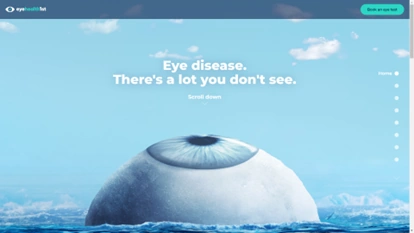
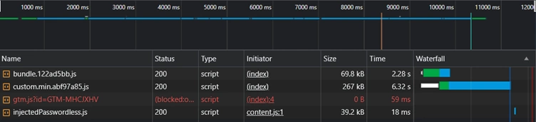
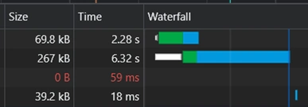
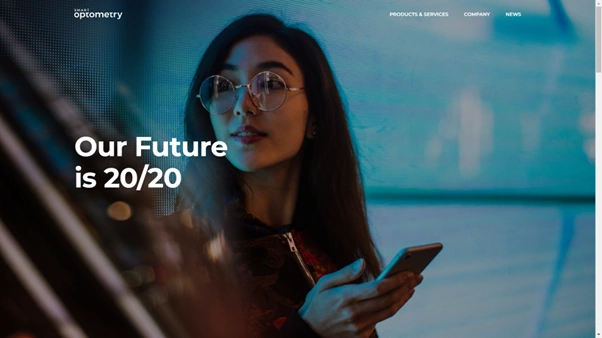
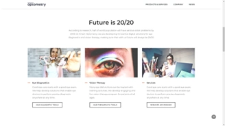
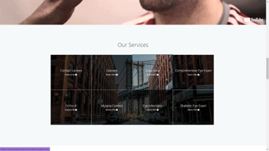
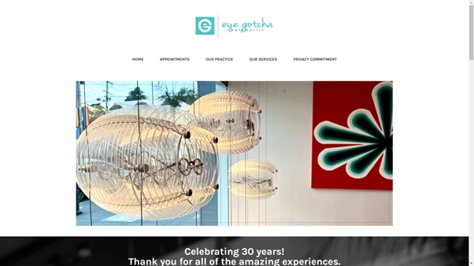
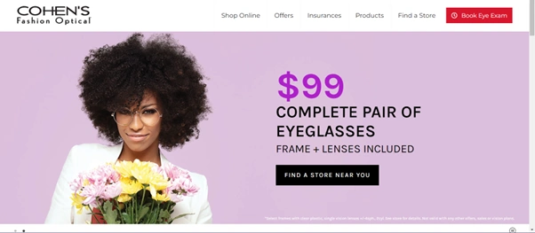

# Project research 

## Look Deeper
https://www.lookdeeper.com.au/

What I like:

* Simplistic, powerful and attractive design.
* Nice animations.
* Interactive fact nodules.
* Simple and cold call to action in top-right of screen.

What I dislike:

Slow load speed is bad for UX. 
The initial load time before caching the JavaScript is **8.5+ seconds**! 

## Smart Optometry
https://www.smart-optometry.com/

What I like:

* Simple bold design. High quality image.
* Bright and attractive images.
* Attractive, simple and easy-to-read font and typeface.

What I dislike:

* Important sections of website haven’t got parts that jump out at you and attract your attention

## Perspective Eyecare
http://www.perspectiveyes.com

What I like:

* Feels more personal.
* Obvious navigation that leads exactly where you want.
* Frequent calls to action.
* Attractive design elements and animation.

What I dislike:

* Look and feel seems off. Feels outdated possibly due to the colour scheme.

## Eye Gotcha
https://www.eyegotchasf.com/

## COHEN'S Fashion Optical
https://www.cohensfashionoptical.com/

## Example of opticians website with a page explaining testing

https://www.visionexpress.com/eye-test/eye-test-explained
