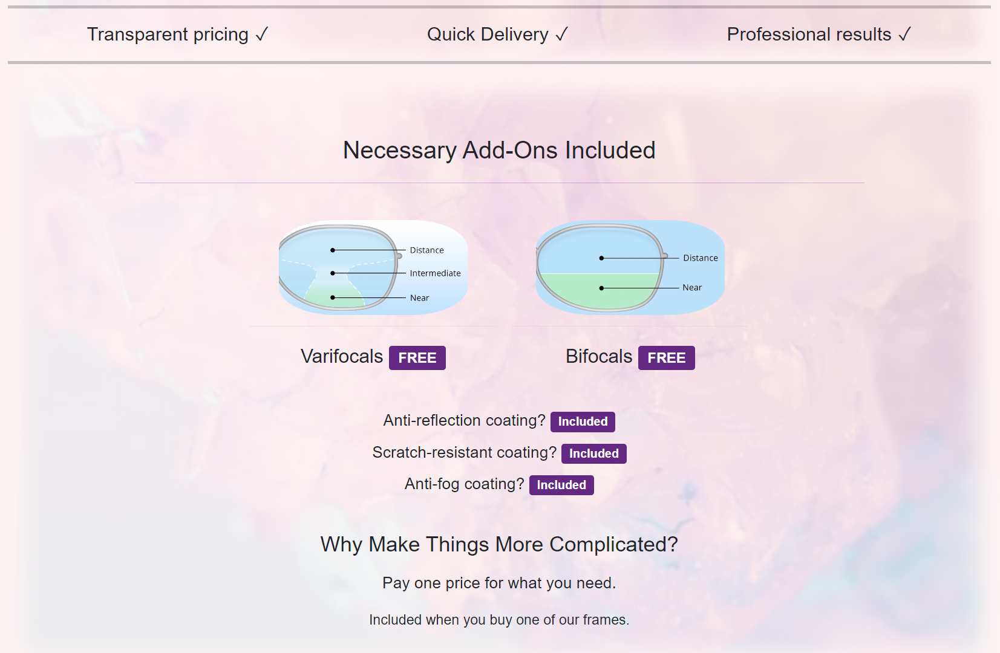
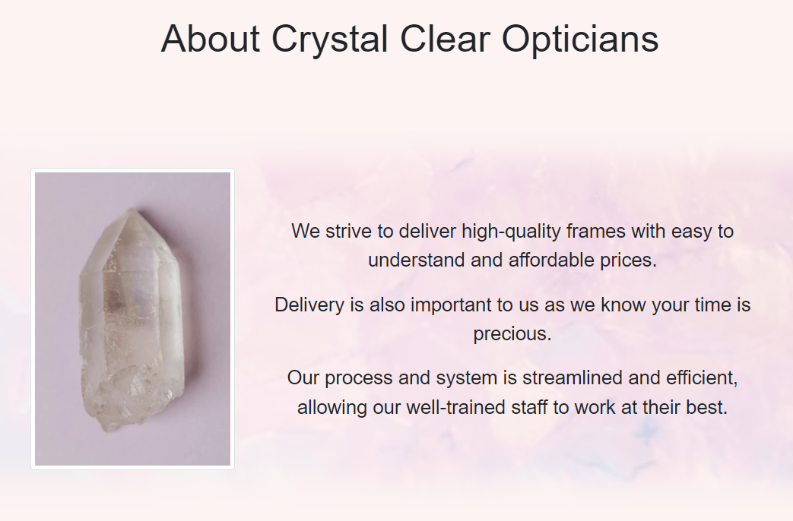
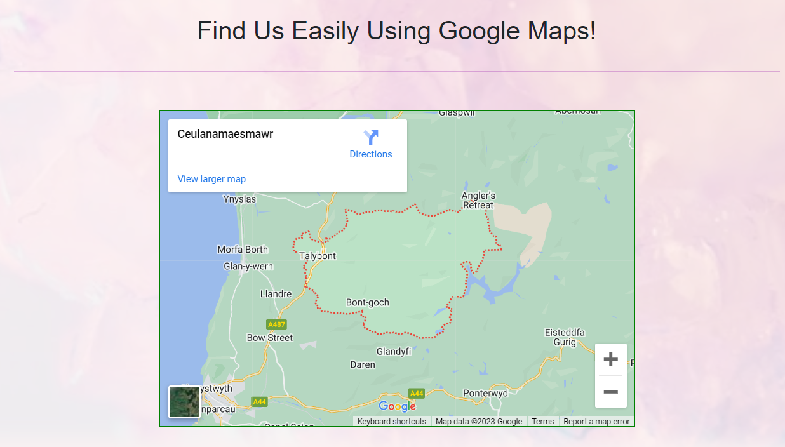
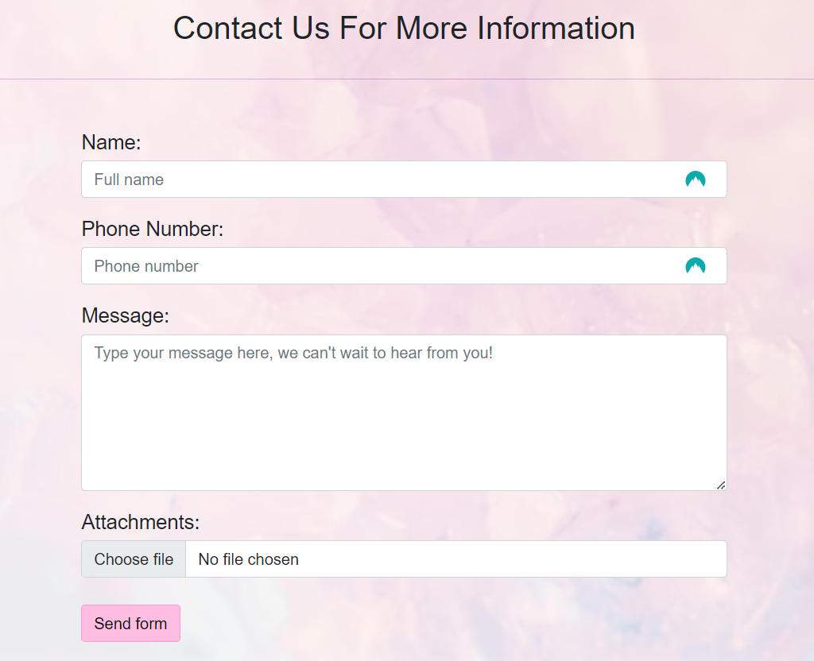
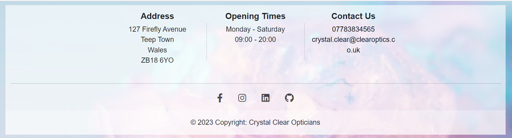
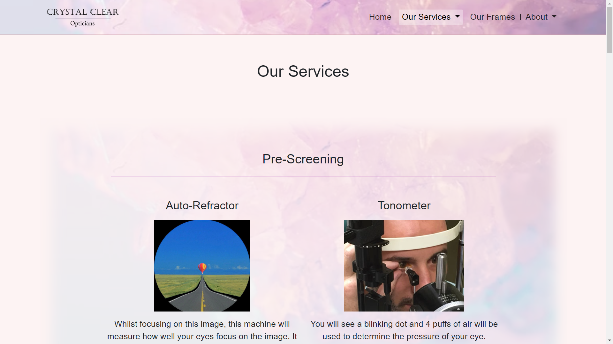
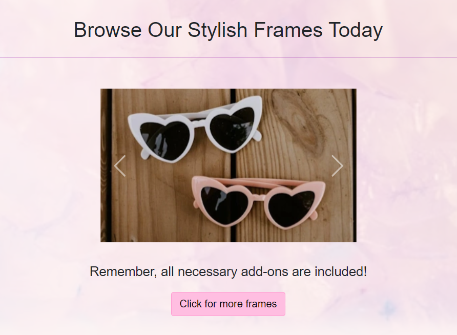
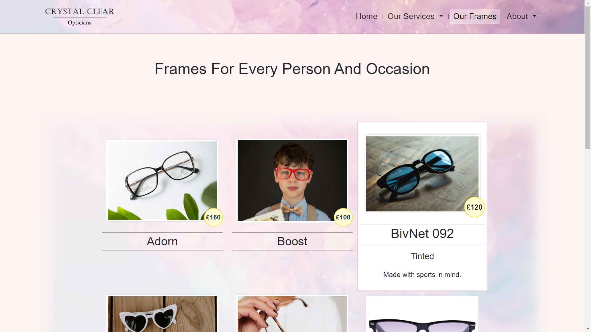
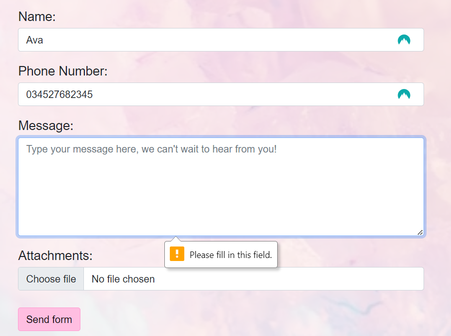

1. **As a first-time user I want to find out more about the opticians and how the glasses are priced.**

    **a.** From the homepage you can find Crystal Clear Optician's clear and affordable pricing structure.
    

    **b.** You can see that there is an About page in the nav bar that explains Crystal Clear Optician's values. There's also a map with the location and a contact form. 
    The embedded map from Google Maps, has an indistinct location that doesn't relate to Crystal Clear Opticians. Unfortunately, it's no possible to supply a real map here as Crystal Clear Opticians and its town is a fictional place. Adding placeholder content is is my only option.
    
    
    

    **c.** There is location and contact information in the footer along with social media icon links.
    

2. **As a first-time user I want to find out how to get to the opticians.**

    **a.** The address is in the footer of every page.

    **b.** There is a handy map in the About section that will take you to Google Maps for directions.

3. **As a first-time user I want to find links to the shop's social media.**

    **a.** You can find the social media icon links in the footer. Using aria-labels, these are accessible to people using screen readers.

4. **As a first-time user I want to see what to expect if I book an appointment.**

    **a.** There is a whole page you can find in the nav bar that explains all the services available to patients called 'Our Services'.

    

5. **As a recurring user I want to see whether there are new frames.**

    **a.** On the homepage, there is a frame spotlight that will link to the 'frames' page.
    

    **b.** The 'frames' page, called 'Our Frames' in the nav, displays all the frames available with prices and a description.
    

6. **As a recurring user I may want to contact the opticians to check an appointment date/time.**

    **a.** You can find the contact form in the About section. It gives feedback once the form is submitted.
    
    
    
    **b.** You can also find a phone number and email in the footer of every page.