# **Crystal Clear Opticians** - Milestone Project 1

This website showcases Crystal Clear Opticians which is a highly efficient and affordable opticians with a range of glasses.
It is built with responsiveness at its core and made to be accessible, especially for people with vision problems. It has bigger font sizes and a simplified navigation system.

This project demonstrates the development of my knowledge of HTML5, CSS3, and UX design after studying the modules with Code Institute. It's a static website, with no server-side code, purely demonstrating my skills in front-end development.


[View live project](https://avabellaw.github.io/crystal-clear-opticians)


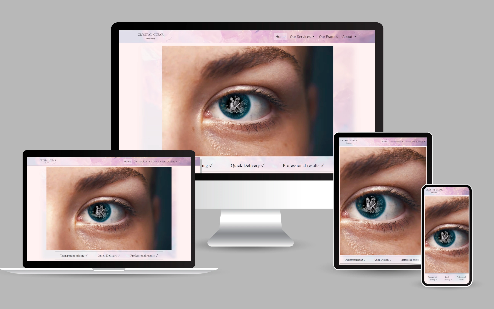

## User Experience (UX)

### Project Goals

Crystal Clear is an efficient optician that delivers fast while maintaining a transparent and easy-to-understand pricing structure with no hidden add-ons. It also sells a range of frames and performs private eye tests.
The site aims to drive traffic to the business, give insight to patients on what to expect, and allow them to browse their most popular frames.

To plan, design and create the project, I used the 5 planes of UX design with a mobile-first approach:
* Strategy - Project requirements and audience.
* Scope - What features to include based on the strategy plane?
* Structure - The structure of information and how it's grouped.
* Skeleton - How is the information presented and navigated?
* Surface - The look and feel of the project.

### Strategy Plane

#### User Goals

The target audience is a mixed group of ages with a focus on older people as most people find they need glasses between ages 41-61. The target audience will also be many people with impaired vision. 
As a result, font sizes are big and the site maintains a simple and intuitive layout. Most font sizes use rem (or em) which enables the user to scale font size easily.

The navigation is comprised of 4 main sections that contain the most important and frequently accessed information.

User goals are:

* Find out what to expect at an eye test appointment.
* Gain more information on eye care.
* Browse glasses.
* Find out the location and contact details.
* View pricing structure.

These goals are delivered by:

* Having a services dropdown in the navigation that explains the shop's process.
* While explaining the process, the site delivers information on eye care.
* Has a dedicated section in the navigation that shows off the glasses cleanly and simply.
* All the shop information is found through the About dropdown. Has a handy map embedded in the site using an iframe from Google Maps.
* Demonstrates pricing structure clearly on the homepage.

Site owner goals are:

* Show off the most popular frames in the shop.
* Attract people to the shop to buy frames.
* Attract people to book appointments in-store.

These goals are delivered by:
* Having a dedicated "Our Frames" page included in the top navigation.
* Demonstrating what makes Crystal Clear Opticians special throughout the content.
* Show what to expect to expect when visiting the opticians and the benefits. 

#### Research

You can find the research I conducted for this project [by clicking this link](docs/research/research.md).

### Scope Plane

Potential features to include:
* A glasses portfolio where users can hover over glasses to reveal more information.
* Showcase equipment and what to expect at an eye test, animations showing what they’re like.
* Provide information on opening times, pricing, contact information and location.

Mini features:
* Advert for additional add-ons.
* What we stand for.

The footer should include:
Contact – Location – Opening times

Possible features for the future:
* Mini nav inside the footer.
* A way to book appointments online.
* A section dedicated to eye care.

### Structure Plane

Pages:
* Home page – With pricing on it.
* Our Frames - A selection of the best frames for various purposes.
* Our Services - Demonstrate the services provided and what to expect.
* About: Our Practise - Location – Contact Us

### Skeleton Plane

I decided to create my wireframe in Figma. To see the comments I've made, you will need to view the wireframe logged into an account such as a Google account. I didn't realize this at the time and may decide to use a different way of creating wireframes in future projects.

You can find my [Figma wireframe design here](https://www.figma.com/file/WwV5w1zGJeC9GBHZv7LHMA/Opticians?type=design&node-id=49-21&mode=design). 

Navigate the different pages by clicking the logo icon in the top-left corner.

I decided in this plane and the structure plane that the desired information could be easily found by grouping them into four main pages. These pages would have a dropdown to get to different sections within them.
 
* Home - An external user wants to learn as much about Crystal Clear as possible. They should learn about its amazing pricing structure as early as possible.
* Our frames - They need to be assured at a glance that glasses are sold and what kinds of glasses to expect.
* Our services - "What should I expect at my appointment?" - Our Services jumps out at the user asking this question with a dropdown that narrows down what they want to know.
* About - A user is likely to expect to find the location and more information about the actual store here with a dropdown to quickly confirm this. It's also a great place for a contact form. 

The logo can also be clicked to get back to the homepage. This is very common in websites and intuitive to the majority of users.

In the design phase, my original idea was to try to keep the 4 links in the navigation visible on all devices as it is on my wireframe mockup. This was to make it immediately evident what pages were available to the user. This, however, turned out to not work well in practice as the text and/or logo would look disproportionately small. It also meant that I wouldn't be able to use purely Bootstrap classes to change to a hamburger on very small devices. 
I decided to replace it with a hamburger menu on smaller devices which is an accepted as way of displaying a menu on mobile that still adheres to UX design principles.

### Surface Plane

I decided to use the following fonts that complement each other:
* Assistant - Navbar and footer
* Poppins - Body

There will be a hero image on the homepage and a tagline. This simple layout doesn't overwhelm the user with information and is aesthetically pleasing. It also lets the user know the core principles and selling points of Crystal Clear Opticians.
The crystal in the eye is an indirect way of clearly conveying a focus on the eyes. It is intended to stick in the back of the user's mind whenever they browse or think of the website.

Throughout the project, a crystal background image will be used. It will be found in the navigation and footer background and it will also appear faded behind each section of content.

## User Stories

1. As a first-time user I want to find out more about the opticians and how the glasses are priced.
2. As a first-time user I want to find out how to get to the opticians.
3. As a first-time user I want to find links to the shop's social media.
4. As a first-time user I want to see what to expect if I book an appointment.
5. As a recurring user I want to see whether there are new frames.
6. As a recurring user I may want to contact the opticians to check an appointment date/time.

In future releases:

* A recurring and first-time user may want to book and check on appointments

## Technologies Used

### Languages Used

* HTML5  
* CSS3
* JavaScript

### Frameworks, Libraries & Programs Used

* Bootstrap 5.0.2:
    * Used for responsiveness out-the-box, utility classes and components that allow for reliable design 
    * Reduce time wasted on reinventing the wheel. 
* Google Fonts
    * Gives easy access to many fonts supplied through a CDN that downloads close to the region of the user. Speeding up delivery.
    * I used the fonts: Assistant and Lora - used throughout the website. Lora for content and Assistant for the headings and nav/footer.
* JQuery
    * Used to add tooltips, make the nav responsive and add a dropdown within the nav.
    * I edited Bootstrap's JQuery to allow me to create new rules for the nav dropdown such as dropdown on hover when on screens that can hover.
* Font Awesome 
    * Gives professional icons.
* Git 
    * Used for version control.
* GitHub
    * Used to store commits and to present the project using GitHub pages
* Visual Studio Code
    * Used as the IDE for the project.
    * I set a shortcut for Visual Code's HTML/CSS formatting to ctrl+shift+f.
* Visual Studio Code extension - Live Server by Ritwick Dey
    * Used instead of Python to run a server to host the website on localhost in two clicks.
* Python - http.server
    * The Live Server extension started to not work reliably towards the end of the project and it became easier to just run the server in Python.
* Paint.NET
    * Used to edit and create images for the project such as the homepage hero and the visual FIELDS gif in services.html
* Figma
    * Used to create the mockup of the website before developing.
* Word 
    * Used to present the project requirements in my own words, for project research, and for brainstorming.
* Notepad and Notepad++
    * Used for quick notes from my mentor and for notes while developing.
* Chrome - Inspect element
    * This was used to:
        * Style the website and test new ideas to be copied into the project.
        * Continuously test responsiveness by adjusting the screen size and by testing preset device dimensions.
        * Bug fix.
        * Find out how Bootstrap is styling elements.
* Firefox, Microsoft Edge, Safari
    * Used to test compatibility for other browsers.
* [Responsinator](http://www.responsinator.com/) for testing on different screens.
* [Image aspect ratio and resizing calculator](https://red-route.org/code/image-resizing-calculator)
    * For working out what width and height an image should have when first loaded on a mobile
* [Grammarly](https://app.grammarly.com/)
    * To help find grammar and spelling mistakes to correct.

## Testing

The W3C Markup Validator and W3C CSS Validator Services were used to validate every page as I went to ensure unexpected errors were kept to a minimum. I used these validators at the end to ensure there were no validation errors upon project submission.

* [W3C Markup Validator](https://validator.w3.org/#validate_by_input)

    * [index.html results](docs/validation/html-results/index-results.webp)
    * [services.html results](docs/validation/html-results/services-results.webp)
    * [frames.html results](docs/validation/html-results/frames-results.webp)
    * [about.html results](docs/validation/html-results/about-results.webp)
    * [form-submitted results](docs/validation/html-results/form-submitted-results.webp)

* [W3C CSS Validator](https://jigsaw.w3.org/css-validator/#validate_by_input)

    * [style.css results](docs/validation/css-results/style-results.webp)
    * [homepage.css results](docs/validation/css-results/homepage-results.webp)
    * [services.css results](docs/validation/css-results/services-results.webp)
    * [frames.css results](docs/validation/css-results/frames-results.webp)
    * [about.css results](docs/validation/css-results/about-results.webp)

My commit messages when fixing and committing these errors/warnings varied slightly. This was due to not always being able to keep within the character limit.

### HTML Validator Notes

I needed to remove trailing slashes from the meta and link tags for all my pages.

#### index.html

I used the validator to fix errors such as accidentally putting width and height on an image container instead of the image tag. 
I also realized that using <section> purely as a container for every section of content was a mistake after the validator threw warnings because there were no h2-h5 tags. After researching, I decided to replace these redundant tags with divs on every page.

#### about.html

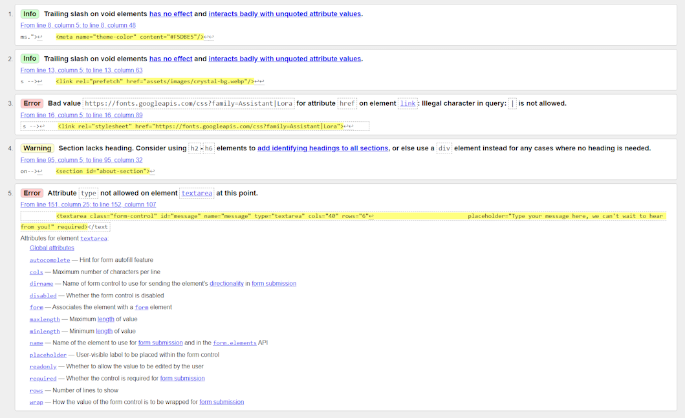

The textarea tag on the contact form had a type attribute with the value “textarea” so I removed this.

#### services.html

This page had the most validator errors/warnings.

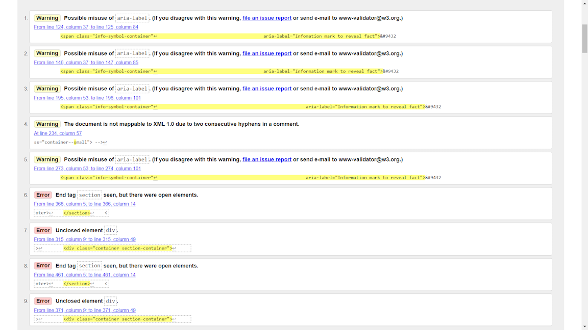

There was a warning for using a double hyphen as a class name as it won't work with XML 1.0.
I decided to keep this in as I used double hyphens to signify a modifier class because I went by the BEM (Block, Element, Modifier) model to name classes. In the future, I will consider whether I should use a different way of signifying a modifier.

I had to remove section end tags and fix two divs that were never closed.

I also updated the aria-label for the information mark to “Click to reveal fact” and added aria-details pointing to the fact that is revealed that's within a paragraph tag.

This eliminated all validation errors/warnings apart from the consecutive hyphen warning.
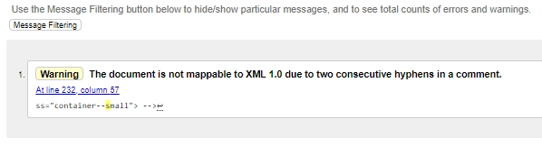

### CSS Validator Notes

My main CSS file did not have any validation errors or warnings that need to be actioned. I will have validated the CSS earlier on in the project which may be in part why this is the case. I should have documented this at the time. 

The CSS validator gives the warning "Due to their dynamic nature, CSS variables are currently not statically checked". 
This warning is thrown because it can't check the variable without running the code. 
Setting a default value would remove the warning but I can't find a comfortable default for most values. As this is only a warning and the code is functional, I have kept the code as is. 

This was the same for all the other CSS files I used. However, I hadn’t previously used the validator on these smaller files:
* about.css
* frames.css
* home.css
* services.css

### Testing User Stories

1. **As a first-time user I want to find out more about the opticians and how the glasses are priced.**

    **a.** From the homepage you can find Crystal Clear Optician's clear and affordable pricing structure.
    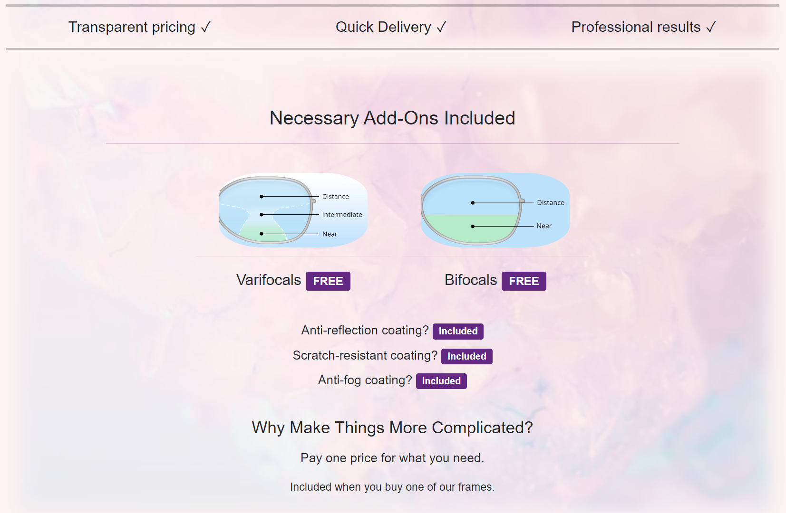

    **b.** You can see that there is an About page in the nav bar that explains Crystal Clear Optician's values. There's also a map with the location and a contact form. 
    The embedded map from Google Maps, has an indistinct location that doesn't relate to Crystal Clear Opticians. Unfortunately, it's no possible to supply a real map here as Crystal Clear Opticians and its town is a fictional place. Adding placeholder content is is my only option.
    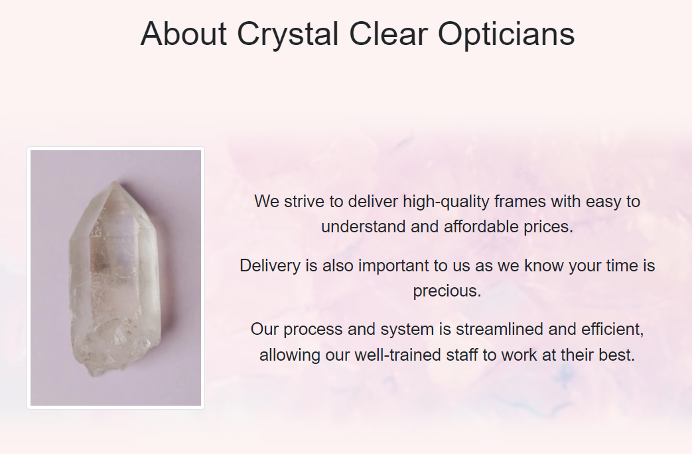
    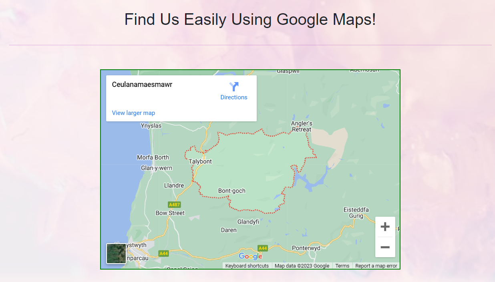
    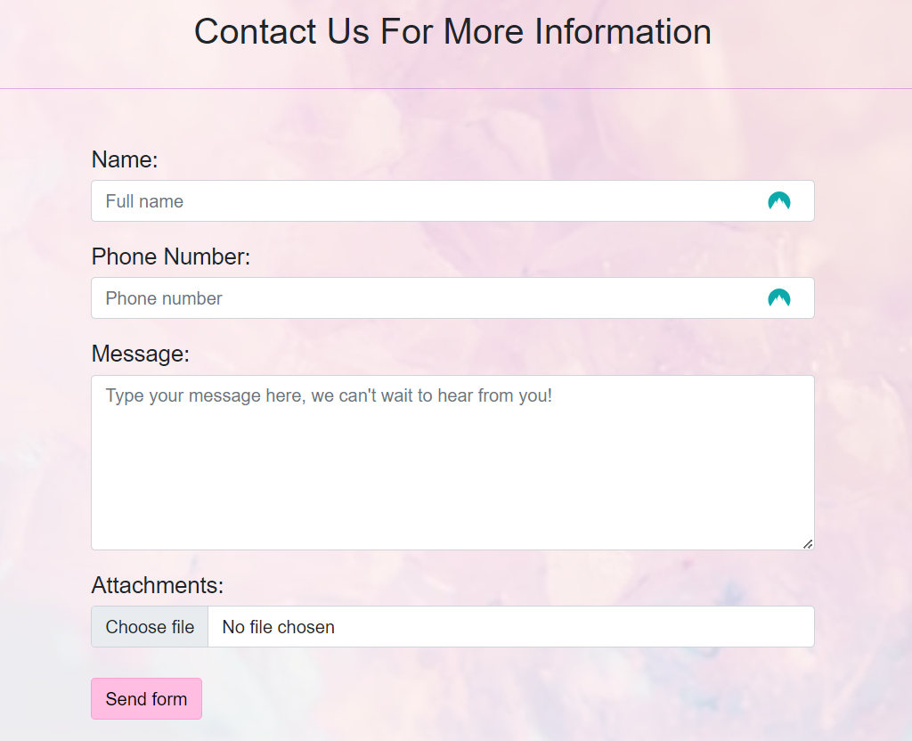

    **c.** There is location and contact information in the footer along with social media icon links.
    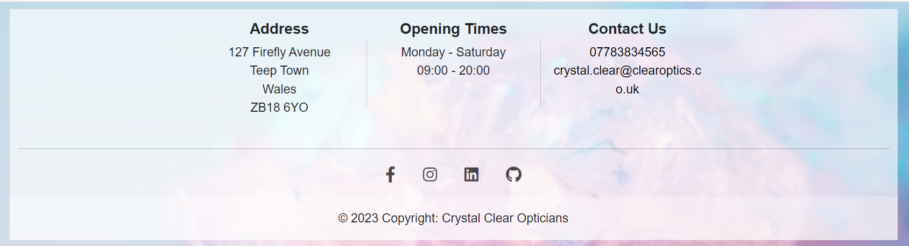


2. **As a first-time user I want to find out how to get to the opticians.**

    **a.** The address is in the footer of every page.

    **b.** There is a handy map in the About section that will take you to Google Maps for directions.

3. **As a first-time user I want to find links to the shop's social media.**

    **a.** You can find the social media icon links in the footer. Using aria-labels, these are accessible to people using screen readers.

4. **As a first-time user I want to see what to expect if I book an appointment.**

    **a.** There is a whole page you can find in the nav bar that explains all the services available to patients called 'Our Services'.

        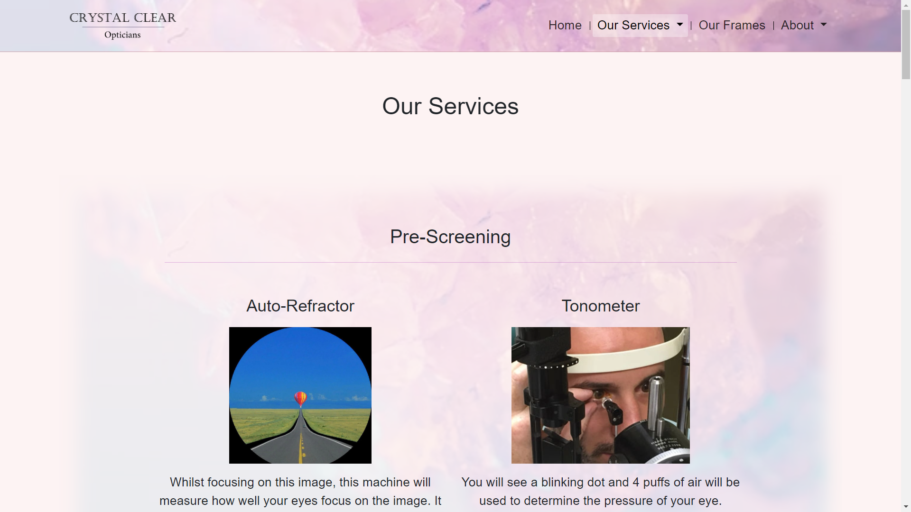

5. **As a recurring user I want to see whether there are new frames.**

    **a.** On the homepage, there is a frame spotlight that will link to the 'frames' page.
    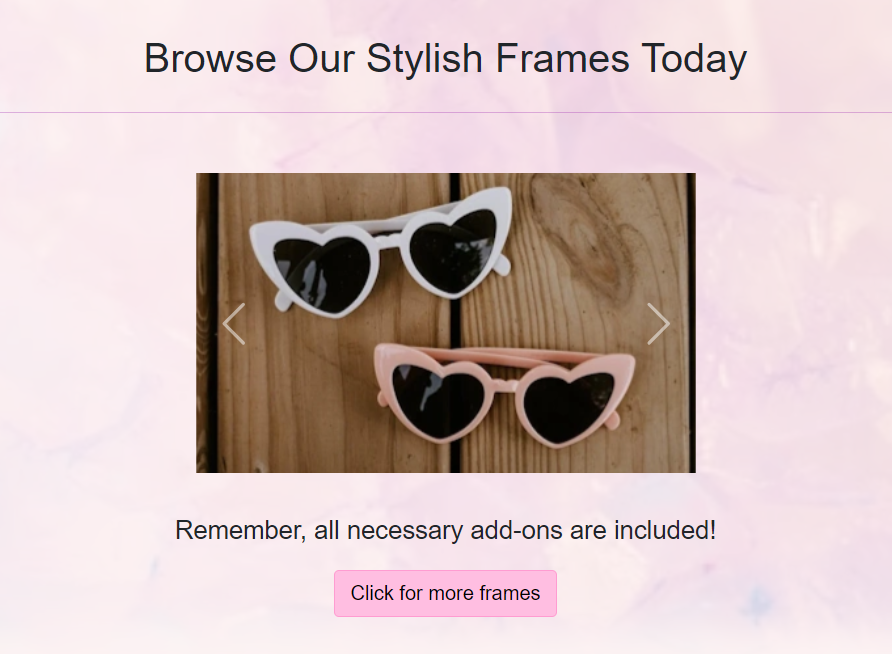

    **b.** The 'frames' page, called 'Our Frames' in the nav, displays all the frames available with prices and a description.
    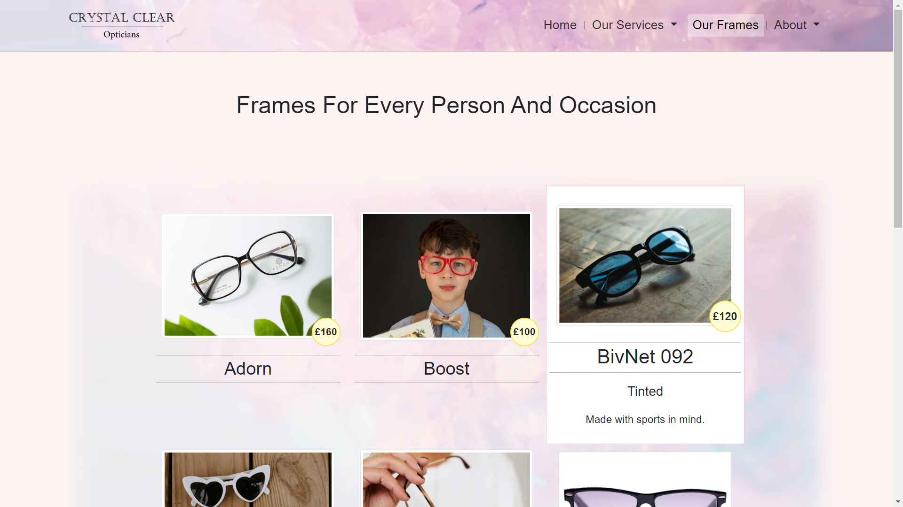

6. **As a recurring user I may want to contact the opticians to check an appointment date/time.**

    **a.** You can find the contact form in the About section. It gives feedback once the form is submitted.
    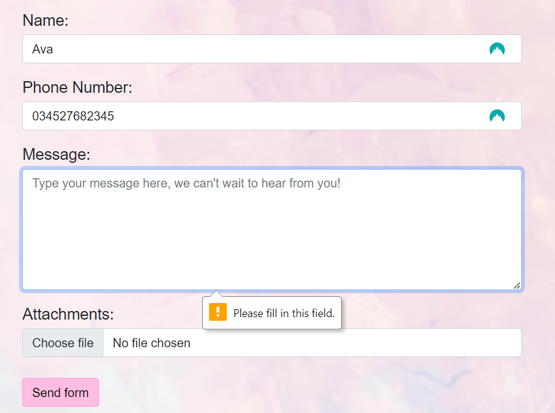
    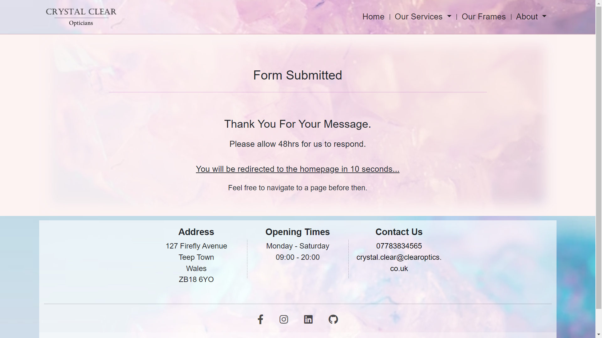
    
    **b.** You can also find a phone number and email in the footer of every page.

### Manual Testing

* Social media icons.
    * I originally used tooltips but decided there was enough information given through the well-known icons and that it distracted from the icons itself. I also thought it took away from the aesthetics of the icons and animation.
    * I tested clicking through the icons and found that they opened the links internally rather than opening a new tab.
* Testing the website on real-life devices.
    * I found that phones and tablets included the top address bar in the whole viewport height (100vh). On emulators, the address bar wasn't included meaning this didn't happen. I was able to use some Javascript to rectify this but I decided that it was out of the scope of this project and may add more problems. If this website were to be revisited, I would include the fix to this problem. 
* Testing website on emulated iPad Air.
    * I found that the top navbar and the tagline appeared too small when using vh. I decided to add a media query to enlarge these elements when on a device with an aspect ratio of 5/3.
* I noticed the fields test animation was off-center. Using keyboard shortcuts, I reduced the width and height of each image, that was used to create the gif, by 1px and then re-created the animation. The steps I performed to do this were as follows:
    1. Ctrl + A, ENTER: Select and open all 12 images in paint.net
    2. ctrl + shift + R: Change canvas size on the current image
    3. Canvas size editor will open starting on the width box, with the aspect ratio maintained
        * For the first image, anchor it to the top-left to reduce size from the bottom-right corner **This will now be default**

            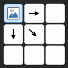 
    4. Type 249px
    5. ENTER
    6. Ctrl + S: Save 
    7. Crtl + W: Close picture
    8. Repeat 1-7 for all images
    9. Recreate the gif with the new images
* The words within the nav links would break onto a new line when the viewport width was too small. I fixed this at the end of the project by using flex-shrink to shrink the logo to create more space. I also created a media query to make padding and margins smaller which would avoid the logo having to shrink too small.
* About page hero wasn't centred on Microsoft Edge and I fixed this by adding margin:auto to the about-hero-container. I also noticed that the words were getting squished and becoming very tall. I simply changed the container-sm to container-md to allow for more space on small devices.
* After testing on my partner's old Samsung phone, I found that I forgot to put a line break between the phone number and email within the footer's contact section. They were changed from paragraph tags to anchor tags since I last tested on mobile and, because anchor tags are inline elements, they don't wrap to a new line if they have space.
* On mobile, I discovered that the fact bubble that is revealed upon clicking the info-mark was too narrow. I realised I had missed a number off a media query, making it "min-width:57px" instead of "min-width:576px". The media query set the width to only 40% of the viewport on devices that were medium or larger but that media query condition was always met. I decided to set it to 80% normally and 60% on large devices.
* Clicking the nav dropdown buttons too quickly on desktop, meant that it would try to open even though it was already due to the mouse hovering over it. I solved this issue by disabling the dropdown button first, and then enabling it if the device didn't have the capacity to hover over the menu options.
I would rather the dropdown not be disabled by default and I would like to revise the code as it isn't very well written. I decided not to because I didn't want to waste too much time on this as Javascript won't be graded on this project. I had attempted to revise this code in the past but I didn't due to this reason. Additionally, the revision would've involved removing some CSS that could be graded.
* While editing the Javascript for the nav dropdown menus, I realised that I was suppoed to have moved the Javascript into it's own file to be reused on each page. Therefore, I did this before fixing the above bug.

### Further Testing

* Tested on Google Chrome, Firefox and Microsoft Edge.
* Continuously tested by adjusting the width of the page to discover breakpoints and useful information such as where max-width should be used.
* Viewed on Chrome's preset device dimensions: iPhone SE, Samsung Galaxy S8+, Laptop, iPad Air and various others including Nest Hub. I switched up with brands I used for phones, laptops, tablets, etc.
* Tested links and whether they went to the right places and opened the correct way.
* My mentor, partner, and friends reviewed the website and documentation to check for bugs or user experience issues I may have gone blind to or simply wouldn't have noticed. I also asked for input on some decisions from my partner.
* I tested using my Samsung s21 and using a few of my friend's phones.

#### Google Lighthouse

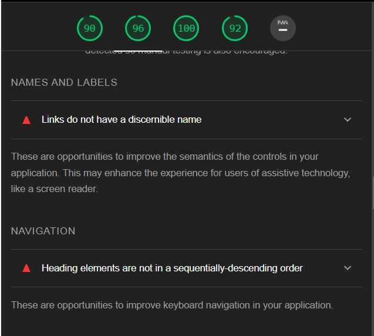

I went through the HTML and changed headings to make them flow in a sequential order. The diagram headings needed to become h3s and I changed the footer headings from h5s to h1s. I made sure to avoid this throughout all pages.

The logo link tag pointing to the homepage didn't have an aria-label associated with it, therefore I added this in.

I added the theme_color metadata to set the colour of the address bar on mobile devices. After adding this and the description meta tag, I got 100 for SEO on the homepage

Homepage hero takes 0.45s to load. Added prefetch in link tag to improve the load speed of the responsive image by loading aside stylesheets
Also prefetch the crystal-bg-webp image that is used for the background of the navbar, sections, and footer.

**No explicit width and height set on images**

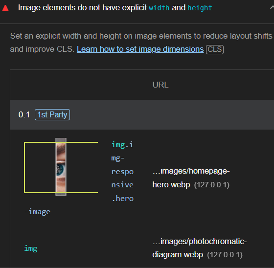

All my images were created to be as responsive as possible. This causes the page to continuously resize and change the layout as the content and styling is loaded.

Performance will take a hit due to this, especially on smaller devices such as phones. Following a mobile-first approach meant that this was an especially important problem that needed to be solved and avoided in the future.
Setting a width and height will let the browser know how much space to reserve for that image.

I went through all the images on my web pages and worked out a width and height that would be suitable and maintain its aspect ratio. Giving the browser the aspect ratio can improve performance on its own. I also tried to adapt the CSS to avoid resizing the image on smaller devices as much as possible.
While working out width and height values, I took the opportunity to resize images to a size closer to what it is displayed as while maintaining the quality on larger devices.

**Ensure text remains visible during webfont load**

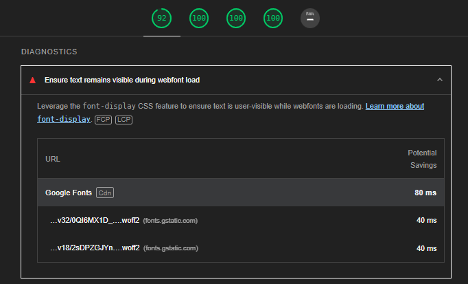

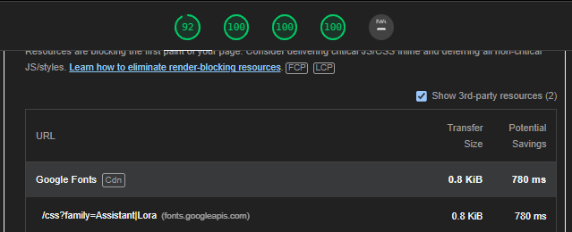 

I used the Google Fonts website to obtain the HTML to preconnect to its servers. This saves time when it comes to loading the fonts.
I then used “&display=swap” to ensure text remained visible before swapping to the desired fonts.

**Google fonts is render-blocking**

I preloaded Google fonts which stopped it from render blocking and showing up as something that could be improved:

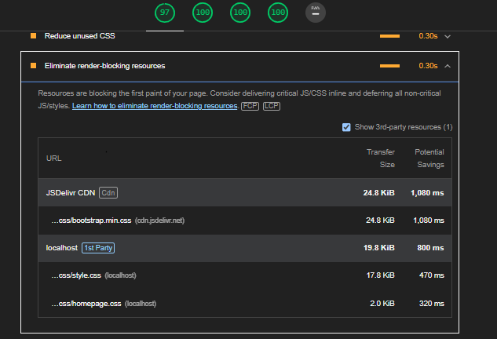

However, I did receive a warning because the fonts weren't being used immediately: 

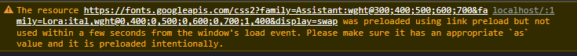

I decided to switch to prefetching the fonts but this gave me a validation error when using the W3 HTML validator, therefore I converted back to using preload. If I came back to this project, I would research more into prefetching and preloading to reduce the impact on performance and work on removing the warning.

### Known Bugs

* One user experience issue I haven't overcome is allowing touchscreen users to click the dropdown button to go to the main page instead of skipping to sections within them. Eg. going to the About page instead of the location section of the About page. 
* Devices with a width under 250px begin to distort the webpage, however, this accounts for a minuscule percentage of users browsing the internet. 
* If you open the dropdown with a device that can't hover (for example a tablet or mobile) then switch to one that can like a desktop, the already open dropdown will try to open and you will need to refresh. In a real-life application, this wouldn't be a bug. 
* I was unable to get 'animation' or 'transition' to work on the dropdown sub menus when on a mobile device.
* The info-mark when clicked, will open a fact with a zoomIn transition. This will only work the first time.

### Deployment

#### GitHub Pages

The project was deployed to GitHub Pages using the following steps:

1. Log in to GitHub and locate the GitHub Repository.
2. At the top of the Repository (no, locate the "Settings" Button on the menu.
    * Alternatively Click Here for a GIF demonstrating the process starting from Step 2.
3. Scroll down the Settings page until you locate the "GitHub Pages" Section.
4. Under "Source", click the dropdown called "None" and select "Master Branch".
5. The page will automatically refresh.
6. Scroll back down through the page to locate the w published site link in the "GitHub Pages" section.

#### Forking the GitHub Repository

By forking the GitHub Repository we make a copy of the original repository on our GitHub account to view and/or make changes without affecting the original repository by using the following steps...

1. Log in to GitHub and locate the GitHub Repository
2. At the top of the Repository just above the "Settings" Button on the menu, locate the "Fork" Button.
3. You should now have a copy of the original repository in your GitHub account.

#### Making a Local Clone

1. Log in to GitHub and locate the GitHub Repository
2. Under the repository name, click "Clone or download".
3. To clone the repository using HTTPS, under "Clone with HTTPS", copy the link.
4. Open Git Bash
5. Change the current working directory to the location where you want the cloned directory to be made.
6. Type `git clone`, and then paste the URL you copied in Step 3.

```
$ git clone https://github.com/avabellaw/crystal-clear-opticians
```

7. Press Enter. Your local clone will be created.

```
$ git clone https://github.com/avabellaw/crystal-clear-opticians
> Cloning into `CI-Clone`...
> remote: Counting objects: 10, done.
> remote: Compressing objects: 100% (8/8), done.
> remove: Total 10 (delta 1), reused 10 (delta 1)
> Unpacking objects: 100% (10/10), done.
```

[Click Here](https://help.github.com/en/github/creating-cloning-and-archiving-repositories/cloning-a-repository#cloning-a-repository-to-github-desktop) to retrieve pictures for some of the buttons and more detailed explanations of the above process.

## Credits

### Content

All content was written by the developer, Ava.

Services.html cataract surgery facts: 
* Success rate of surgery [from laservisionscotland](https://www.laservisionscotland.co.uk/best-time-for-cataract-surgery/#:~:text=Success%20rates%20for%20Cataract%20surgery,people%20have%20successful%20cataract%20surgery)
* Time to recover [from the nhs](https://www.nhs.uk/conditions/cataract-surgery/#:~:text=Cataract%20surgery%20involves%20replacing%20the,fully%20recover%20from%20cataract%20surgery.)

Service.html [information mark character code](https://stackoverflow.com/questions/33878539/is-there-an-html-entity-for-an-info-icon)

Eye SVG for bullet points [from Font Awesome](https://fontawesome.com/icons/eye?f=classic&s=solid)
 
### Code

* [Boostrap 5](https://blog.getbootstrap.com/2021/06/22/bootstrap-5-0-2/) Used intermittently throughout to provide a responsive and easy-to-use grid system.
* Navbar created using [Bootstrap's navbar]([https://getbootstrap.com/docs/5.0/components/navbar/]) and then modified.
* Footer also uses Bootstrap classes
* Code to open navbar dropdowns on hover taken from this [Stackoverflow post]([https://www.geeksforgeeks.org/how-to-make-menu-dropdown-on-hover-using-bootstrap/]) 
* JQuery _check device can hover_ code taken from [this website](https://dev.to/niorad/detecting-hover-and-touch-in-css-and-js-4e42)
* Disable dropdown on click to prevent issues taken from [Stackoverflow post](https://stackoverflow.com/questions/15697968/how-to-disable-bootstraps-button-dropdown)
* When the form is submitted, you are taken to a thank you page that auto-redirects back to index.html. This was suggested to me by my mentor Darío Carrasquel.
* Styling content using [Boostrap typography](https://getbootstrap.com/docs/5.0/content/typography/)
* For creating the gradient to be used with <mark> to highlight text, I used [cssgradient.io](https://cssgradient.io/)
* How to [preload images](https://web.dev/preload-responsive-images/)
* [Using defer and async on the script tag](https://blog.logrocket.com/9-tricks-eliminate-render-blocking-resources/)
* [Eliminating render-blocking resources](https://sia.codes/posts/render-blocking-resources/)
* How to use flex-shrink from [cssreference](https://cssreference.io/property/flex-shrink/#:~:text=default%20flex%2Dshrink%3A%201%3B,and%20will%20wrap%20its%20content.&text=flex%2Dshrink%3A%200%3B,and%20not%20wrap%20its%20content.)

### Media

#### Images

Multi-device mockup template for readme from [freepik](https://www.freepik.com/free-vector/flat-design-responsive-website-design_28747712.htm#query=multi%20device%20mockup&position=6&from_view=keyword&track=ais)

Images were sourced from the following places:
* [Pexels](https://www.pexels.com)
* [Unsplash](https://unsplash.com)
* [Flaticon](https://www.flaticon.com)
* [AllAboutVision](https://www.allaboutvision.com)
* [Stockvolt](https://www.stockvault.net)

Image used for the background of the navbar, footer and section backgrounds:
https://unsplash.com/photos/PrQqQVPzmlw

The homepage hero is comprised of two images sourced that I edited together in paint.NET:
* [Homepage hero main picture](https://unsplash.com/photos/UbJMy92p8wk)
* [Quarts crystal edited into eye](https://unsplash.com/photos/k65_6C4hu2E)

General images:
* [Phoropter](https://www.pexels.com/photo/crop-woman-holding-trial-frame-against-white-background-5715892/)
* [Box of lenses](https://www.pexels.com/photo/collection-of-lenses-for-checking-vision-in-medical-center-5752235/)
* [Collection of glasses](https://unsplash.com/photos/oqlEKLMmTNg)

Glasses icons:
* https://www.flaticon.com/free-icon/summer_75908?term=glasses&page=1&position=22&origin=tag&related_id=75908
* [Sun icon](https://www.flaticon.com/free-icon/sun_2917242)
* [Empty glasses](https://www.flaticon.com/free-icon/sun-glasses_7531327?term=glasses&page=1&position=58&origin=search&related_id=7531327&k=1689952306708&sign-up=google)

Diagrams:
* [Bifocal diagram image](https://www.allaboutvision.com/lenses/multifocal.htm)
* [Varifocal diagram image](https://crescentheightsoptometry.com/wp-content/uploads/2015/10/progressive-660x326.webp?quality=100.3019052014480)
* [Auto-refractor hot air balloon](https://www.reddit.com/r/LiminalSpace/comments/orxnb7/it_just_feels_so_off/)
* [Tonometer example image](https://www.reviewofoptometry.com/article/the-dos-and-donts-of-measuring-iop)

Image references for the frames section of the website:

* https://www.pexels.com/photo/photo-of-round-eyeglasses-on-white-surface-2530391/
* https://www.stockvault.net/photo/125815/glasses
* https://www.pexels.com/photo/stylish-elegant-eyeglasses-for-vision-improvement-4226870/
* https://www.pexels.com/photo/stylish-heart-shaped-sunglasses-on-wooden-surface-6479569/
* https://www.pexels.com/photo/trendy-sunglasses-placed-on-wooden-table-5472304/
* https://www.pexels.com/photo/crop-stylish-lady-woman-holding-eyeglasses-in-hand-4468154/
* https://www.pexels.com/photo/funny-dog-in-pink-eyeglasses-and-accessory-5731803/
* https://www.pexels.com/photo/modern-eyeglasses-against-plant-foliage-on-white-background-7923926/
* https://www.pexels.com/photo/happy-boy-with-books-looking-at-camera-7258418/
* https://www.pexels.com/photo/spectacles-placed-on-objective-lens-7501398/
* https://unsplash.com/photos/d05w6_7FaPM

The diagrams for light-reactive and tinted lenses were created by me in paint.net using icons I've previously credited. Using one glasses icon, I edited different colour lenses to demonstrate them reacting to light and also what different tints would look like.

### GIFS

GIF animation to demonstrate the fields test created by me using paint.net and [ezgif](https://ezgif.com/maker). I used 12 pictures.
I made the contrast quite low which was realistic. After creating the GIF, I decided to edit it using ezgif Maker to improve visibility. I decreased the brightness (-15%) but increased the contrast (+50%).

### Videos

Video of cataracts surgery on  Our Services page [from pixabay](https://pixabay.com/videos/cataract-surgery-eye-retina-vision-4215/)
