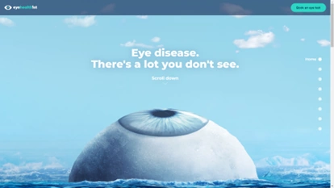
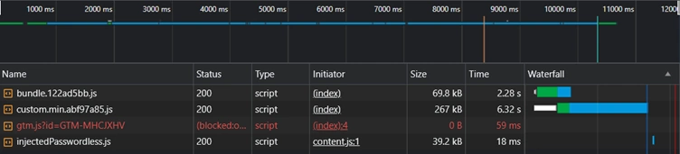
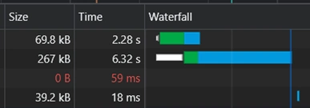
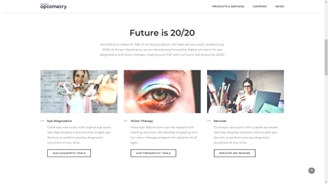
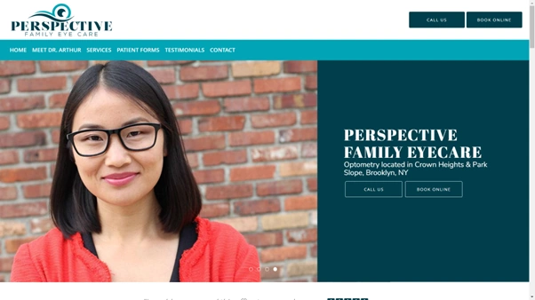
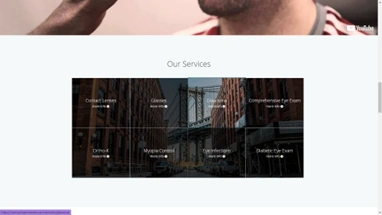
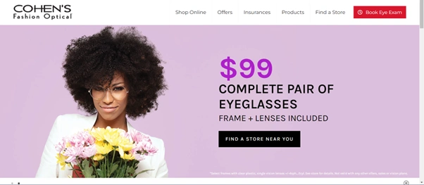

# Milestone Project 1 - Crystal Clear Opticians

## UX

### Project Goals

Crystal Clear Opticians is a new shop selling a range of frames and performing private eye tests.
The site aims to drive traffic to the buisness, give an insight to patients on what to expect and allow them to browse their most popular frames.

## User Goals

The target audience is a mixed-group of ages with a focus on older people as most people find they need glasses bettwen ages 41-61. The target audience will also contain many people with impaired vision. 
As a result, font-sizes are big and the site maintains a simple and intuitive layout. 

The navigation is comprised of 4 main sections that contain the most important and frequently accessed information.

Crystal Clear is an efficient opticians that delivers fast while maintining a transparent and easy to understand pricing structure with no hidden add-ons.

User goals are:

* Find out what to expect at an eye test appointment.
* Gain more information on eye care.
* Browse glasses.
* Find out location and contact details.
* View pricing structure.

These goals are delivered on by:

* Having a services dropdown in the nagivation that explains the shop's process.
* While explaning the process, the site delivers information on eye care.
* Has a dedicated section in the navigation that shows off the glasses in a clean and simple way.
* Has all the shop information is found through the about dropdown. Has a handy map embeded in the site using an iframe from Google Maps.
* Demonstrates pricing structure clearly on the homepage.


Site owner goals are:

* Show off the most popular frames in the shop.
* Attract people to the shop to buy frames.
* Attract people to book appointments in-store.

## Technologies Used

### Languages Used

* HTML5  
* CSS3
* JavaScript

### Frameworks, Libraries & Programs Used

* Bootstrap 5.0.2:
    * Used to for responsiveness out-the-box, utility classes and components that allow for reliable design and reduces time wasted by reinventing the wheel. 
* Google Fonts
    * Gives easy access to many fonts supplied through a CDN that downloads close to the region of the user. Speeding up delivery.
    * I used the fonts: Assistant, Lora - used throughout the website. Lora for content and Assistant for the headings and nav/footer.
* JQuery
    * Used to add tooltips, make nav responsive and add a dropdown within the nav.
    * I edited Bootstrap's JQuery to allow me to create new rules for the nav dropdown such as dropdown on hover when on screens that can hover.
* Font Awesome 
    * Gives professional icons.
* Git 
    * Used for version control.
* GitHub
    * Used to store commits and to present project using GitHub pages
* Visual Studio Code
    * Used as the IDE for the project.
* Visual Studio Code extension - Live View
    * Used instead of Python to run a server to host the website on localhost in two clicks.
* Paint.NET
    * Used to edit and create images for the project such as the homepage hero and the visual FIELDS gif in services.html
* Figma
    * Used to create the mockup of the website before developing.
* Word 
    * Used to present the project requirements in my own words, for project research and for brainstorming.
* Notepad and Notepad++
    * Used for quick notes from my mentor and for notes while developing.
* Chrome - Inspect element
    * This was used to:
        * Style the website and test new ideas to be copied into the project.
        * Continously test responsiveness through adjusting the screen size and by testing preset device dimensions.
        * Bug fix.
        * Find out how Bootstrap is styling elements.
* Firefox, Microsoft Edge, Safari
    * Used to test compatability for other browsers.

## Testing

The W3C Markup Validator and W3C CSS Validator Services were used to validate every page as I went to ensure unexpected errors were kept to a minimum. I used these validators at the end to ensure there were no validation errors upon project submission.

* [W3C Markup Validator](https://jigsaw.w3.org/css-validator/#validate_by_input)
* [W3C CSS Validator](https://jigsaw.w3.org/css-validator/#validate_by_input)

### Testing User Stories from User Experience (UX) Section NOT FINISHED

### Further Testing

* Tested on Google Chrome, Firefox, Safari, Microsoft Edge and Internet Explorer
* Continously tested by adjusting the width of the page to discover breakpoints and useful information such as where max-width should be used.
* Viewed on Chrome's preset device dimensions: IPhone SE, Samsung Galaxy S8+, Laptop, iPad Air and varias others including Nest Hub. I switched up with brands I used for phones, laptops and tablets etc.
* Tested links and whether they went to the right places and opened the correct way.
* My mentor, partner and friends reviewed the website and documentation to check for bugs or user experience issues I may have gone blind too or simply wouldn't have noticed. I also asked for input on some decisions from my partner.

### Known Bugs

* One user experience issue I haven't overcome is allowing touchscreen users to click the dropdown button to go to the main page instead of skipping to sections within them. Eg. going to the about page instead of the about section of the the about page. 
* Devices with a width under 250px begin to distort the webpage, however, this accounts for a minuscule percentage of users browsing the internet. 

### Deployment ASK MENTOR WHETHER OKAY I COPIED FROM THE CODE INSTITUTE README

#### GitHub Pages

The project was deployed to GitHub Pages using the following steps:

1. Log in to GitHub and locate the GitHub Repository.
2. At the top of the Repository (not top of page), locate the "Settings" Button on the menu.
    * Alternatively Click Here for a GIF demonstrating the process starting from Step 2.
3. Scroll down the Settings page until you locate the "GitHub Pages" Section.
4. Under "Source", click the dropdown called "None" and select "Master Branch".
5. The page will automatically refresh.
6. Scroll back down through the page to locate the now published site link in the "GitHub Pages" section.

#### Forking the GitHub Repository

By forking the GitHub Repository we make a copy of the original repository on our GitHub account to view and/or make changes without affecting the original repository by using the following steps...

1. Log in to GitHub and locate the GitHub Repository
2. At the top of the Repository (not top of page) just above the "Settings" Button on the menu, locate the "Fork" Button.
3. You should now have a copy of the original repository in your GitHub account.

#### Making a Local Clone

1. Log in to GitHub and locate the GitHub Repository
2. Under the repository name, click "Clone or download".
3. To clone the repository using HTTPS, under "Clone with HTTPS", copy the link.
4. Open Git Bash
5. Change the current working directory to the location where you want the cloned directory to be made.
6. Type `git clone`, and then paste the URL you copied in Step 3.

```
$ git clone https://github.com/YOUR-USERNAME/YOUR-REPOSITORY
```

7. Press Enter. Your local clone will be created.

```
$ git clone https://github.com/YOUR-USERNAME/YOUR-REPOSITORY
> Cloning into `CI-Clone`...
> remote: Counting objects: 10, done.
> remote: Compressing objects: 100% (8/8), done.
> remove: Total 10 (delta 1), reused 10 (delta 1)
> Unpacking objects: 100% (10/10), done.
```

[Click Here](https://help.github.com/en/github/creating-cloning-and-archiving-repositories/cloning-a-repository#cloning-a-repository-to-github-desktop) to retrieve pictures for some of the buttons and more detailed explanations of the above process.


## Research 

### Look Deeper
https://www.lookdeeper.com.au/



What I like:

* Simplistic, powerful and attractive design.
* Nice animations.
* Interactive fact nodules.
* Simple and cold call to action in top-right of screen.

What I dislike:

Slow load speed is bad for UX. 
The initial load time before caching the JavaScript is **8.5+ seconds**! 



### Smart Optometry
https://www.smart-optometry.com/


What I like:

* Simple bold design. High quality image.
* Bright and attractive images.
* Attractive, simple and easy-to-read font and typeface.



What I dislike:

* Important sections of website haven’t got parts that jump out at you and attract your attention

### Perspective Eyecare
http://www.perspectiveyes.com



What I like:

* Feels more personal.
* Obvious navigation that leads exactly where you want.
* Frequent calls to action.
* Attractive design elements and animation.



What I dislike:

* Look and feel seems off. Feels outdated possibly due to the colour scheme.

### Eye Gotcha
https://www.eyegotchasf.com/


### COHEN'S Fashion Optical
https://www.cohensfashionoptical.com/



### Example of opticians website with a page explaining testing
https://www.visionexpress.com/eye-test/eye-test-explained

---

## Credits

### Content

All content was written by the developer, Ava.

[Charactor code for information (i)](https://stackoverflow.com/questions/33878539/is-there-an-html-entity-for-an-info-icon)
[Eye SVG for bullet points from Font Awesome](https://fontawesome.com/icons/eye?f=classic&s=solid)
 
### Code

* [Boostrap 5](https://blog.getbootstrap.com/2021/06/22/bootstrap-5-0-2/) Used intermittendly throughout to provide a responsive and easy to use grid system.
* Navbar created using [Bootstrap's navbar]([https://getbootstrap.com/docs/5.0/components/navbar/]) and then modified.
* Footer also uses Bootstrap classes
* Code to open navbar dropdowns on hover taken from this [Stackoverflow post]([https://www.geeksforgeeks.org/how-to-make-menu-dropdown-on-hover-using-bootstrap/]) 
* JQuery _check device can hover_ code taken from [this website](https://dev.to/niorad/detecting-hover-and-touch-in-css-and-js-4e42)
* Disable dropdown on click to prevent issues taken from [Stackoverflow post](https://stackoverflow.com/questions/15697968/how-to-disable-bootstraps-button-dropdown)
* When form is submitted, you are taken to a thank you page that auto-redirects back to index.html. This was suggested to me by my mentor Darío Carrasquel.
* Styling content using [Boostrap typography](https://getbootstrap.com/docs/5.0/content/typography/)
* For creating the gradient to be used with <mark> to highlight text, I used [cssgradient.io](https://cssgradient.io/)

### Media

#### Images

Images were sourced from the following places:
* [Pexels](https://www.pexels.com)
* [Unsplash](https://unsplash.com)
* [Flaticon](https://www.flaticon.com)
* [AllAboutVision](https://www.allaboutvision.com)
* [Stockvolt](https://www.stockvault.net)

Image used for background of the navbar, footer and section backgrounds:
https://unsplash.com/photos/PrQqQVPzmlw

The homepage hero is comprised of two images sourced from:
* [Homepage hero main picture](https://unsplash.com/photos/UbJMy92p8wk)
* [Quarts crystal edited into eye](https://unsplash.com/photos/k65_6C4hu2E)

General images:
* [Phoropter](https://www.pexels.com/photo/crop-woman-holding-trial-frame-against-white-background-5715892/)
* [Box of lenses](https://www.pexels.com/photo/collection-of-lenses-for-checking-vision-in-medical-center-5752235/)
* [Collection of glasses](https://unsplash.com/photos/oqlEKLMmTNg)
* 

Glasses icons:
* https://www.flaticon.com/free-icon/summer_75908?term=glasses&page=1&position=22&origin=tag&related_id=75908
* [Sun icon](https://www.flaticon.com/free-icon/sun_2917242)
* [Empty glasses](https://www.flaticon.com/free-icon/sun-glasses_7531327?term=glasses&page=1&position=58&origin=search&related_id=7531327&k=1689952306708&sign-up=google)

Diagrams:
* [Bifocal diagram image](https://www.allaboutvision.com/lenses/multifocal.htm)
* [Varifocal diagram image](https://crescentheightsoptometry.com/wp-content/uploads/2015/10/progressive-660x326.webp?quality=100.3019052014480)
* [Auto-refractor hot air balloon](https://www.reddit.com/r/LiminalSpace/comments/orxnb7/it_just_feels_so_off/)
* [Tonometer example image](https://www.reviewofoptometry.com/article/the-dos-and-donts-of-measuring-iop)


Image references for the frames section of website:

* https://www.pexels.com/photo/photo-of-round-eyeglasses-on-white-surface-2530391/
* https://www.stockvault.net/photo/125815/glasses
* https://www.pexels.com/photo/stylish-elegant-eyeglasses-for-vision-improvement-4226870/
* https://www.pexels.com/photo/stylish-heart-shaped-sunglasses-on-wooden-surface-6479569/
* https://www.pexels.com/photo/trendy-sunglasses-placed-on-wooden-table-5472304/
* https://www.pexels.com/photo/crop-stylish-lady-woman-holding-eyeglasses-in-hand-4468154/
* https://www.pexels.com/photo/funny-dog-in-pink-eyeglasses-and-accessory-5731803/
* https://www.pexels.com/photo/modern-eyeglasses-against-plant-foliage-on-white-background-7923926/
* https://www.pexels.com/photo/happy-boy-with-books-looking-at-camera-7258418/
* https://www.pexels.com/photo/spectacles-placed-on-objective-lens-7501398/
* https://unsplash.com/photos/d05w6_7FaPM

### GIFS

GIF animation to demonstrate FIELDS test created by me using paint.net and [ezgif](https://ezgif.com/maker). I used 12 pictures.
I made the contrast quite low which was realistic however decided to edit the gif using ezgif maker to improve visibility. I decreased the brightness (-15%) and increased the contrast (+50%).

### Videos

Video of cataracts surgery on servies page [from pixabay](https://pixabay.com/videos/cataract-surgery-eye-retina-vision-4215/)
