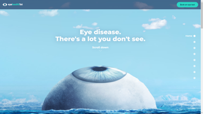
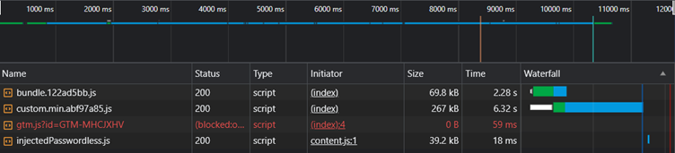
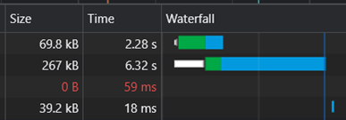
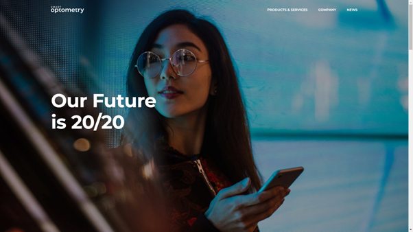
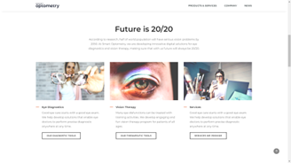
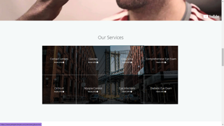
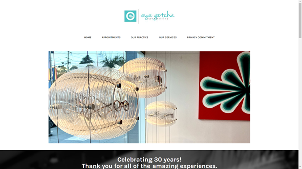

# Milestone Project 1 - Crystal Clear Opticians

## UX

### Project Goals

Crystal Clear Opticians is a new shop selling a range of frames and performing private eye tests.
The site aims to drive traffic to the buisness, give an insight to patients on what to expect and allow them to browse their most popular frames.

## User Goals

The target audience is a mixed-group of ages with a focus on older people as most people find they need glasses bettwen ages 41-61. The target audience will also contain many people with impaired vision. 
As a result, font-sizes are big and the site maintains a simple and intuitive layout. 

The navigation is comprised of 4 main sections that contain the most important and frequently accessed information.

Crystal Clear is an efficient opticians that delivers fast while maintining a transparent and easy to understand pricing structure with no hidden add-ons.

User goals are:

* Find out what to expect at an eye test appointment.
* Gain more information on eye care.
* Browse glasses.
* Find out location and contact details.
* View pricing structure.

These goals are delivered on by:

* Having a services dropdown in the nagivation that explains the shop's process.
* While explaning the process, the site delivers information on eye care.
* Has a dedicated section in the navigation that shows off the glasses in a clean and simple way.
* Has all the shop information is found through the about dropdown. Has a handy map embeded in the site using an iframe from Google Maps.
* Demonstrates pricing structure clearly on the homepage.

Site owner goals are:

* Show off the most popular frames in the shop.
* Attract people to the shop to buy frames.
* Attract people to book appointments in-store.

## Research 

### Look Deeper
https://www.lookdeeper.com.au/

What I like:

* Simplistic, powerful and attractive design.
* Nice animations.
* Interactive fact nodules.
* Simple and cold call to action in top-right of screen.

What I dislike:

Slow load speed is bad for UX. 
The initial load time before caching the JavaScript is **8.5+ seconds**! 

### Smart Optometry
https://www.smart-optometry.com/

What I like:

* Simple bold design. High quality image.
* Bright and attractive images.
* Attractive, simple and easy-to-read font and typeface.

What I dislike:

* Important sections of website haven’t got parts that jump out at you and attract your attention

### Perspective Eyecare
http://www.perspectiveyes.com

What I like:

* Feels more personal.
* Obvious navigation that leads exactly where you want.
* Frequent calls to action.
* Attractive design elements and animation.

What I dislike:

* Look and feel seems off. Feels outdated possibly due to the colour scheme.

### Eye Gotcha
https://www.eyegotchasf.com/

### COHEN'S Fashion Optical
https://www.cohensfashionoptical.com/

### Example of opticians website with a page explaining testing
https://www.visionexpress.com/eye-test/eye-test-explained

---

## Credits

### Content

All content was written by the developer, Ava.

### Code

* [Boostrap 5](https://blog.getbootstrap.com/2021/06/22/bootstrap-5-0-2/) Used intermittendly throughout to provide a responsive and easy to use grid system.
* Navbar created using [Bootstrap's navbar]([https://getbootstrap.com/docs/5.0/components/navbar/]) and then modified.
* Footer also uses Bootstrap classes
* Code to open navbar dropdowns on hover taken from this [Stackoverflow post]([https://www.geeksforgeeks.org/how-to-make-menu-dropdown-on-hover-using-bootstrap/]) 
* JQuery _check device can hover_ code taken from [this website](https://dev.to/niorad/detecting-hover-and-touch-in-css-and-js-4e42)
* Disable dropdown on click to prevent issues taken from [Stackoverflow post](https://stackoverflow.com/questions/15697968/how-to-disable-bootstraps-button-dropdown)
* When form is submitted, you are taken to a thank you page that auto-redirects back to index.html. This was suggested to me by my mentor Darío Carrasquel.

### Media

#### Images

Images were sourced from the following places:
* [Pexels](https://www.pexels.com)
* [Unsplash](https://unsplash.com)
* [Flaticon](https://www.flaticon.com)
* [AllAboutVision](https://www.allaboutvision.com)
* [Stockvolt](https://www.stockvault.net)

Image used for background of the navbar, footer and section backgrounds:
https://unsplash.com/photos/PrQqQVPzmlw

The homepage hero is comprised of two images sourced from:
* [Homepage hero main picture](https://unsplash.com/photos/UbJMy92p8wk)
* [Quarts crystal edited into eye](https://unsplash.com/photos/k65_6C4hu2E)

General images:
* [Phoropter](https://www.pexels.com/photo/crop-woman-holding-trial-frame-against-white-background-5715892/)
* [Box of lenses](https://www.pexels.com/photo/collection-of-lenses-for-checking-vision-in-medical-center-5752235/)
* [Collection of glasses](https://unsplash.com/photos/oqlEKLMmTNg)
* 

Glasses icons:
* https://www.flaticon.com/free-icon/summer_75908?term=glasses&page=1&position=22&origin=tag&related_id=75908
* [Sun icon](https://www.flaticon.com/free-icon/sun_2917242)
* [Empty glasses](https://www.flaticon.com/free-icon/sun-glasses_7531327?term=glasses&page=1&position=58&origin=search&related_id=7531327&k=1689952306708&sign-up=google)

Diagrams:
* [Bifocal diagram image](https://www.allaboutvision.com/lenses/multifocal.htm)
* [Varifocal diagram image](https://crescentheightsoptometry.com/wp-content/uploads/2015/10/progressive-660x326.png?quality=100.3019052014480)

Image references for the frames section of website:

* https://www.pexels.com/photo/photo-of-round-eyeglasses-on-white-surface-2530391/
* https://www.stockvault.net/photo/125815/glasses
* https://www.pexels.com/photo/stylish-elegant-eyeglasses-for-vision-improvement-4226870/
* https://www.pexels.com/photo/stylish-heart-shaped-sunglasses-on-wooden-surface-6479569/
* https://www.pexels.com/photo/trendy-sunglasses-placed-on-wooden-table-5472304/
* https://www.pexels.com/photo/crop-stylish-lady-woman-holding-eyeglasses-in-hand-4468154/
* https://www.pexels.com/photo/funny-dog-in-pink-eyeglasses-and-accessory-5731803/
* https://www.pexels.com/photo/modern-eyeglasses-against-plant-foliage-on-white-background-7923926/
* https://www.pexels.com/photo/happy-boy-with-books-looking-at-camera-7258418/
* https://www.pexels.com/photo/spectacles-placed-on-objective-lens-7501398/
* https://unsplash.com/photos/d05w6_7FaPM

